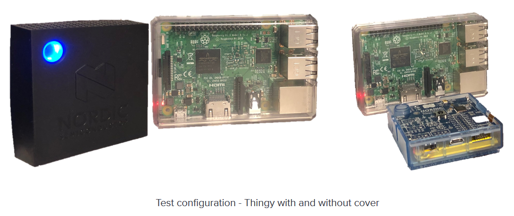

# Home Assistant - test configuration

- provides basic sensor data collection with [Thingy:52](https://www.nordicsemi.com/Software-and-Tools/Development-Kits/Nordic-Thingy-52),
- tested on [Raspberry Pi 3B](<https://www.raspberrypi.org/products/raspberry-pi-3-model-b/>).

## How to use

1. [Prepare component](component).
2. [Prepare framework](homeassistant).
3. Done!
